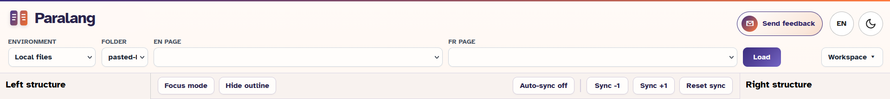
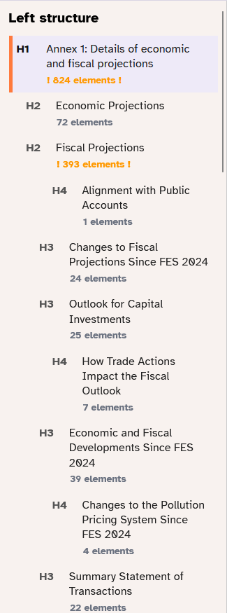
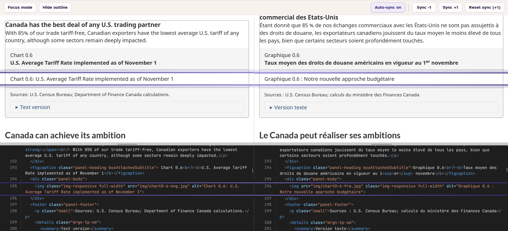
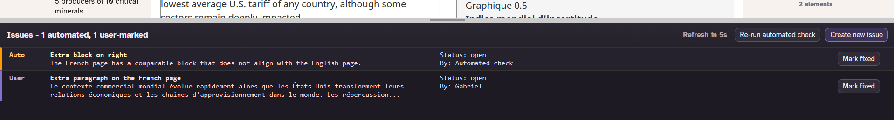
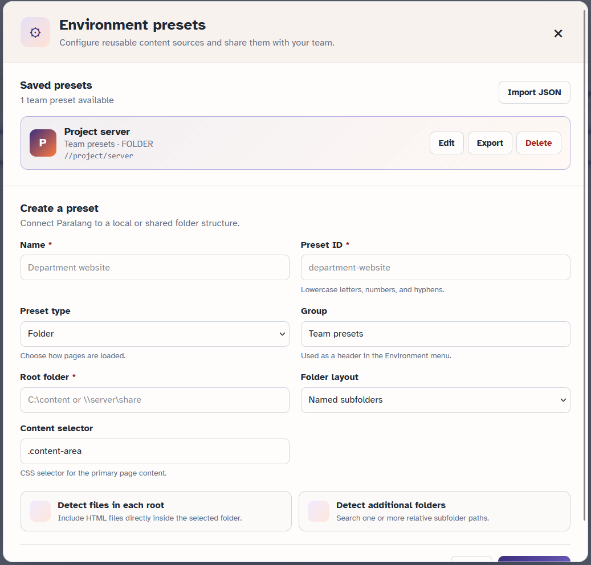
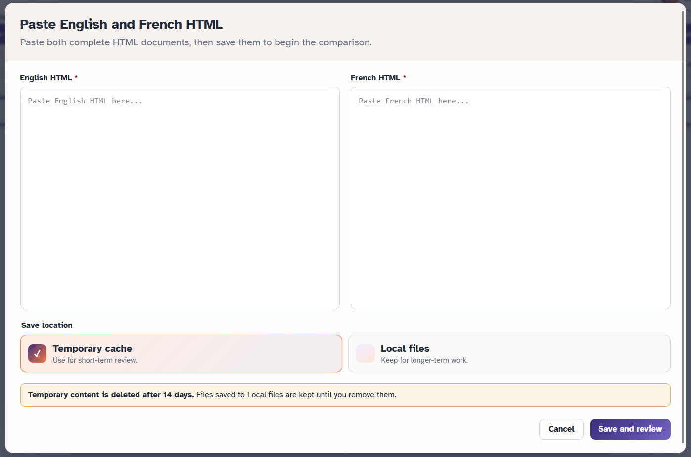
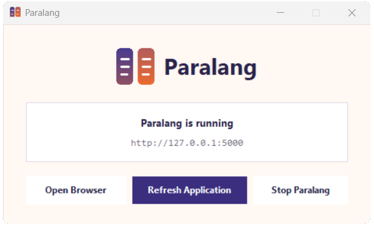

  

<h1>Paralang, the local bilingual HTML review tool</h1>

Paralang is a local bilingual review tool for comparing English and French HTML pages. It keeps the rendered pages, document structure, source code, and review issues together in one workspace so mismatches are easier to find and verify.

<h2>Features</h2>

  

<h3>Bilingual page comparison</h3>

View English and French pages side by side, scroll them together, and use focus mode or element outlines to keep the current content blocks visible. Auto-sync aligns comparable content, while the <code>Sync -1</code>, <code>Sync +1</code>, and reset controls let you correct the alignment manually.

<h3>Structure maps</h3>

Navigate either document from a compact map of its headings. Paralang flags section-count differences and keeps map navigation coordinated with the page views.

  

<h3>Source code view</h3>

Open formatted HTML beneath the rendered pages and follow the selected content in code. The code panels can be resized, expanded, collapsed, or hidden from the Workspace menu.

  

<h3>Automated checks</h3>

Paralang compares the structure and content blocks of a page pair and reports possible problems such as missing sections, heading-level differences, extra blocks, identical text, and large text-length differences. It also compares numeric table cells using English and French number and currency formats, helping identify values that differ across otherwise corresponding rows. Checks refresh when source files change and can also be re-run from the issues panel.

<h3>Review issues</h3>

Create an issue for the selected block using the review form, choose the English or French side, and add a title, comment, and reviewer name. Paralang remembers the reviewer name for the next issue, and selecting an existing issue returns you to the affected page content. User-created and automated issues are stored in <code>data/paralang-issues.json</code> and can be removed when fixed.

  

<h3>Flexible content sources</h3>

Review pages from local files, team-configured folder or URL presets, pasted HTML, or public Canada.ca URLs. URL pages are downloaded to a local cache before review.

Use <strong>Workspace &gt; Manage environments</strong> to create and manage custom presets. Folder presets can point directly at HTML pages or discover named collection folders and relative subfolders such as <code>campaign/pages</code>. URL presets accept pages from one configured public HTTPS website. Both types can use a custom CSS selector to locate the primary page content.

Custom presets can be edited, exported as JSON for another user to import, or deleted. They may also be grouped under custom headings in the Environment menu. Local preset definitions are stored in <code>data/environment-presets.json</code>.

  

For local files, place page pairs under a named folder in <code>data/local-files/</code>, for example:

<pre><code>data/local-files/my-review/
|-- page-en.html
|-- page-fr.html</code></pre>

English filenames must end in <code>-en.html</code> and French filenames in <code>-fr.html</code>. A <code>report-rapport/</code> subfolder is also supported.

<h3>Pasted HTML review</h3>

Paste complete English and French HTML documents directly into Paralang. Paralang creates readable paired filenames, preferring the English H1 when one is available. Choose temporary storage in <code>.cache/pasted_html/</code> or longer-term storage in <code>data/local-files/pasted-html/</code>. Temporary entries older than 14 days are removed when new content is submitted; Local files are retained until removed manually. If similar content already exists, Paralang lets you overwrite it, create a numbered copy, or cancel.

  

<h3>Customizable workspace</h3>

Toggle structure maps, the issues panel, single-page mode, code view, and dark mode. Panel sizes and display preferences are saved in the browser, and the default arrangement can be restored from the Workspace menu.

<h3>English and French interface</h3>

Switch the Paralang interface between English and French from the language button in the header. The selected interface language is remembered in the browser and is applied to dialogs, controls, status messages, and code views.

<h3>In-app feedback</h3>

Use <strong>Send feedback</strong> to report an issue or suggest an improvement. Paralang can prepare either a GitHub issue or an Outlook email containing your comments and automatically includes the app version, computer platform, date, and a report ID. GitHub Issues is recommended for tracking; Outlook remains available for users without a GitHub account. Review the prepared report and remove protected information before sending it.

<h2>Shared team use</h2>

Paralang works best when the project folder is stored on a shared drive and every reviewer launches the same copy from the same path. Issues, environment presets, pasted HTML, and downloaded page caches are stored inside that project folder. If team members run separate copies from different locations, each copy will have its own issues and cached content, so changes will not be shared between reviewers.

Browser-specific settings, such as the selected interface language, dark mode, panel sizes, and workspace layout, remain personal to each reviewer.

<h2>Running locally</h2>

<h3>Portable launcher</h3>

Requirements:

<ul>
  <li>Python 3 with Tkinter and <code>pip</code></li>
  <li>A web browser</li>
</ul>

From the project folder, run:

<pre><code>python launch-paralang.pyw</code></pre>

On Windows, you can also double-click <code>launch-paralang.pyw</code> when <code>.pyw</code> files are associated with Python.

The launcher checks for Flask and Beautiful Soup and installs the pinned packages in <code>requirements.txt</code> with <code>pip</code> if needed. It then starts Paralang at <a href="http://127.0.0.1:5000">http://127.0.0.1:5000</a>, opens the site in your browser, and leaves a small control window running. Use <strong>Refresh Application</strong> to restart the local server and automatically reload open Paralang pages after code changes. Use <strong>Open Browser</strong> to reopen the site and <strong>Stop Paralang</strong> (or close the control window) to stop the server cleanly.

  

<h2>Protected-content safeguards</h2>

Paralang runs only on <code>127.0.0.1</code>. Reviewed HTML is displayed in a sandbox with scripts, forms, embedded frames, plug-ins, and browser network APIs disabled. HTTPS stylesheets, fonts, and images remain available, but page requests use a <code>no-referrer</code> policy so the remote server is not sent the Paralang URL or local filename.

URL imports may follow redirects only while every redirect remains on the environment's configured HTTPS website. Canada.ca imports are further restricted to <code>https://www.canada.ca/en/</code> and <code>https://www.canada.ca/fr/</code>. Pasted HTML requests and downloaded URL pages are limited to 100 MB each. Content stored in <code>data/</code> and <code>.cache/</code> remains local and uses the workstation or shared drive's existing access controls.

If startup fails, diagnostic output is available in <code>.cache/launcher/</code>.

<h3>Manual server</h3>

To run without the desktop launcher, install the dependencies and start Flask directly:

<pre><code>python -m pip install -r requirements.txt
python app.py</code></pre>

Then open <a href="http://127.0.0.1:5000">http://127.0.0.1:5000</a>. Stop the server with <code>Ctrl+C</code>.

